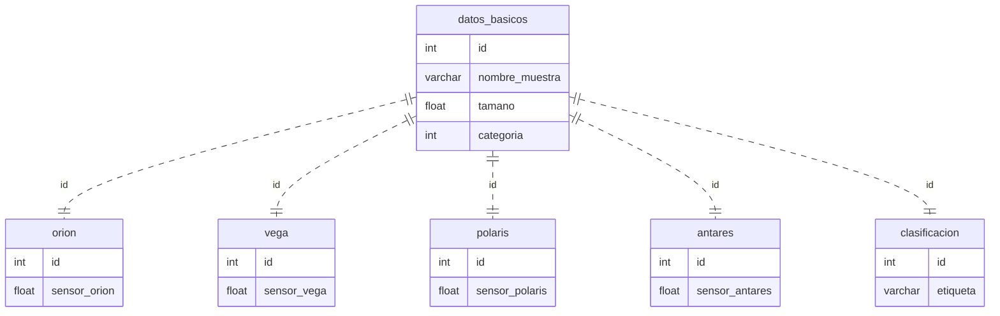
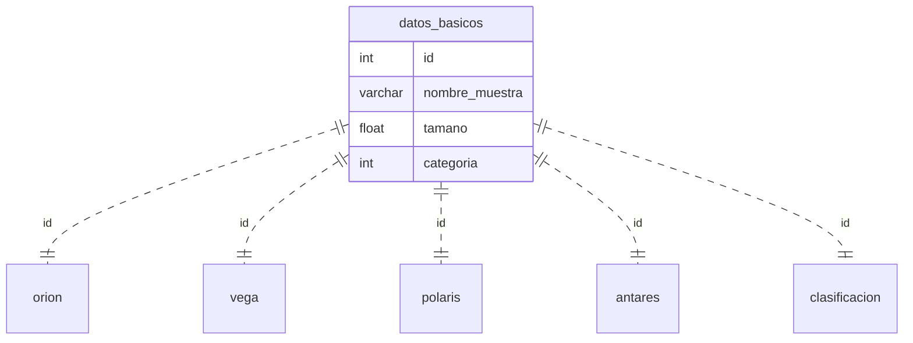

# Clasificaci-n-de-sensores-espaciales-con-Machine-Learning-KNN--Python
Se presenta el desarrollo y los resultados al evaluar un modelo de machine learning KNN para clasificar datos faltantes en la medición de sensores espaciales.
## Modelo de machine learning: clasificación de datos faltantes de las mediciones.
### Objetivos:
* Realizar un análisis de las variables presentes en el problema para identificar los parámetros importantes dentro de la clasificación de la medición de sensores espaciales.
* Proporcionar un estudio detallado de la distribución de los datos con el fin de conocer las formas de clasificarlos y que ajustes realizar.
* Seleccionar y configurar un modelo de machine learning para la clasificación, considerando la adaptabilidad de los datos a la medición de los sensores y optimizando los parámetros del modelo.
* Entrenar el modelo con un conjunto de datos de entrenamiento y evaluar su rendimiento utilizando un conjunto de prueba, métricas como accuracy, reporte de clasificación, matriz de confusión.
* Evaluar la contribución del modelo al completar datos faltantes en mediciones espaciales mediante la comparación de las predicciones con los valores reales, para proporcionar a la empresa una herramienta capaz de completar los datos faltantes en cuanto a la clasificación de las mediciones dadas por los sensores.

### Descripción:
La empresa realiza distintas mediciones en el espacio con cuatro satélites en órbita: orion, vega, polaris, Antares; a partir de esto y de sus datos básicos; se pretende clasificar los datos con dos posibles etiquetas Positivo o Negativo; sin embargo, según el reporte hacen falta clasificar 100 datos. Con este propósito, se plantea desarrollar un modelo de machine learning capaz de clasificar los datos faltantes.
*Estructura de la base de datos:

      

Primero se analiza la base de datos; donde se identifica que los datos faltantes son solo aproximadamente el 3.3% del total de los datos; por lo cual resulta beneficioso ya que es más sencillo para el algoritmo identificar patrones o relaciones de manera precisa, de esta manera, la clasificación de los datos a predecir es posible que sea más precisa. Por otra parte, se tiene que la distribución de las clasificaciones esta balanceada, ya que prácticamente la mitad (148772) de los datos que si tienen etiqueta se identifican como “positivo” y casi la otra mitad (151228 etiquetas) como ” Negativo” esto a través de un conteo. Al tener un equilibrio en la cantidad de muestras para cada clase, el modelo no se sesga hacia ninguna etiqueta específica y tiene la oportunidad de aprender de manera equitativa de ambas clases.

Por otra parte, se descartan las columnas que no se consideran necesarias para evaluar el modelo, solo se tendrá en cuenta: tamaño, categoría, sensor orion, sensor polarias, sensor vega, sensor Antares; para entrenar el modelo; esto mas explicado en el respectivo código. Además, para el entrenamiento y test solo se toman los valores que tienen etiqueta.

Para el modelo de machine learning, inicialmente se evaluo con regresión logística, sin embargo se obtuvo un accuracy del 0.53, por lo que se analiza el modelo KNN o K-Nearest Neighbors, el cual clasifica los datos según la distancia de ese punto a evaluar hacia sus vecinos, clasifica un nuevo dato basándose en la mayoría de los datos cercanos a él. Dada la naturaleza del conjunto de datos de mediciones espaciales de satélites, donde se busca clasificar los datos como Positivos o Negativos, la simplicidad y flexibilidad de KNN resultan beneficiosas; puesto que en este caso solo se necesita realizar una clasificación binaria.
Ya que el código se realiza en Python; en un Notebook de Jupyter, es necesario tener en cuenta las siguientes librerías: pandas, sqlite3, scikit-learn.

### Resultados
El modelo de Machine Learning implementado, basado en el algoritmo K-Nearest Neighbors (KNN),para abordar la clasificación de datos faltantes en las mediciones espaciales de los satélites Orion, Vega, Polaris y Antares; fue entrenado y evaluado utilizando un conjunto de entrenamiento y uno de prueba que representaba el 20% de los datos disponibles. Los resultados obtenidos son los siguientes:
Al evaluar el modelo de machine learning KNN; se obtuvo un accuracy de 0.947; usando un K=9; que se refiere al número de vecinos más cercanos que se toman en cuenta para la clasificación. Se debe tener cuidado puesto que un K muy grande puede arrojar demasiados datos erróneos. En este caso el accuracy indica cual es la proporción de predicciones correctas; como se observa es bastante alta por lo cual se tiene una capacidad efectiva para realizar clasificar en la mayoría de los casos los datos de los sensores.

Por otra parte el reporte de clasificación tiene varios parámetros; sin embargo uno a tener muy en cuenta es el F1-score, que denota un equilibrio entre precisión y recall, es alto para ambas clases. Este equilibrio es esencial, ya que indica que el modelo no favorece en exceso la identificación de una clase a expensas de la otra. En otras palabras, el modelo de clasificación para predecir las etiquetas de los datos no muestra una inclinación hacia las etiquetas Positivo o Negativo de los sensores; lo que permite una alta confiabilidad de las clasificaciones a predecir. 

La matriz de confusión revela un bajo número de falsos positivos y falsos negativos a pesar de la variedad de satélites y categorías de mediciones. Además de que las clases están casi divididas a la mitad, el modelo ha demostrado un buen rendimiento en ambas etiquetas, Positivo y Negativo. Lo que lleva al modelo a dar buenos resultados en diversos escenarios y ser robusto. Por lo tanto lo mas probable es que al evaluar los 100 datos que fueron predichos; entre 6 y 5 de ellos tengan una etiqueta incorrecta.

### Conclusiones

En conclusión, resulta importante un análisis previo a la aplicación de algún modelo de machine learning; porque se puede determinar las características de los datos, la distribución en este caso de las etiquetas Positivo y Negativo; que parámetros determinaran el comportamiento del modelo como la medición de los distintos sensores de los satélites, su tamaño, su categoría. Sirve como herramienta para anticipar posibles obstáculos y reducir riesgos; esencial para diseñar y seleccionar el modelo de machine learning.

En resumen, la clasificación mediante el modelo K-Nearest Neighbors resulta ser altamente efectivo para evaluar etiquetas Positivo o Negativo de las mediciones espaciales; sin embargo se debe tener en cuenta que el parámetro K; se debe ajustar conforme a los datos, puesto que se podría realizar un sobre ajuste a este modelo; lo que resulta en datos erróneos o que pierda la capacidad de adaptarse a patrones más sutiles en los datos, por ende perder fiabilidad, es por eso que se debe elegir teniendo en cuenta busque maximizar la precisión del modelo en datos no vistos. Por su parte el parámetro weights o peso se configuro con respecto a la distancia puesto que prioriza los vecinos o datos que se encuentran mas cerca del punto a evaluar, esto mejora significativamente las métricas que evalúan el rendimiento del algoritmo.

Por otro lado, los resultados obtenidos son bastante buenos, puesto que la probabilidad de error es muy baja teniendo en cuenta la cantidad de datos; es por eso que la etiqueta Positivo o Negativo tiene una alta fiabilidad en los datos de sensores a predecir. Se mira reflejado en parámetros como su alto accuracy del aproximadamente el 0.97; que respalda la eficacia del modelo; además otros como la matriz de confusión, donde se observa un equilibrio efectivo entre verdaderos positivos y verdaderos negativos; lo que señala que el modelo en casi el total de los casos va a realizar una correcta clasificación de los datos obtenidos en los satélites.

En conclusión, el modelo de machine learning propuesto representa una herramienta valiosa para clasificación de datos espaciales; debido a su capacidad para predecir y asignar etiquetas a datos que originalmente no estaban clasificados; además contribuye a la toma de las decisiones con respecto a esta información. Por otra parte, entrenar un modelo reduce significativamente el tiempo en un proceso manual e incluso menos fiable; además de que podría resultar conflictivo puesto que se trabaja con mas de 300000 datos. Así mismo el modelo  el modelo tiene una gran adaptabilidad por lo cual si se desea se podrían evaluar nuevos datos que no presenten una clasificación o ingresar mas información para entrenar el modelo y mejorar su respuesta ante datos espaciales y de satélites.

